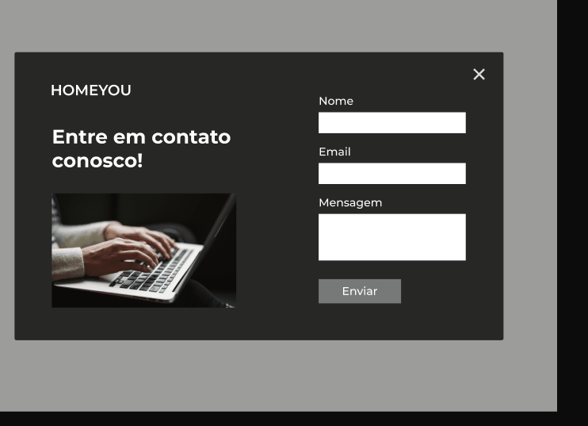

# Home You

Desafio feito da comunidade codelândia do 
[Yuri Silva](https://discord.com/channels/853354677411905578/853363178901733387), nele coloquei em pratica algumas coisas que venho aprendendo!

## Tecnologias utilizadas

* Html Css JS
* Sass ( pré-processador )
* Swiper Js ( para fazer o slide )

## Demonstração

*  Um site totalmente responsivo 
   

## Implementando menu mobile e modal

Decidi fazer algo a mais do que simplesmente fazer o layout do figma.

#### Autor
  Feito por Wallace 👋!
